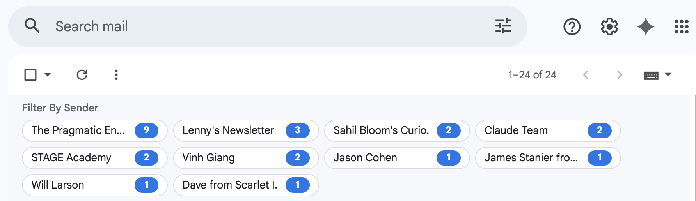

# Gmail Smart Filter

A Chrome extension that injects a "Filter By Sender" bar into Gmail's inbox, showing clickable chips for each unread sender grouped by count.



## Features

- Shows a chip for every unread sender visible in your inbox, sorted by unread count
- Clicking a chip filters to all unread emails from that sender
- Back button appears after filtering so you can return to your previous inbox view
- Strips email `+tags` so `lenny@substack.com` and `lenny+newsletter@substack.com` are grouped together
- Only activates on inbox and section query pages — stays out of the way everywhere else
- No permissions beyond reading the Gmail page you're already on

## Installation

1. Clone or download this repository
2. Open Chrome and go to `chrome://extensions`
3. Enable **Developer mode** (top right toggle)
4. Click **Load unpacked** and select the repository folder
5. Open [Gmail](https://mail.google.com) — the filter bar appears above your inbox

## Development

### Project structure

```
gmail-smart-filter/
├── manifest.json       # Chrome Extension MV3 manifest
├── utils.js            # Pure functions (testable, loaded before content.js)
├── content.js          # Extension logic: DOM scanning, bar rendering, navigation
├── styles.css          # Styles for the filter bar, chips, and back button
├── tests/
│   └── utils.test.js   # Jest unit tests for pure functions
└── icons/
    ├── icon16.png
    ├── icon48.png
    └── icon128.png
```

### Running tests

```bash
npm install
npm test
```

### How it works

1. A `MutationObserver` watches Gmail's DOM for changes
2. After DOM mutations settle (400 ms of quiet), it scans all visible unread thread rows (`tr.zA.zE`) for sender info
3. Senders are aggregated by normalised email address (lowercase, `+tag` stripped) and sorted by count
4. A bar of chips is injected at the top of the inbox — each chip links to a Gmail search for that sender's unread inbox messages
